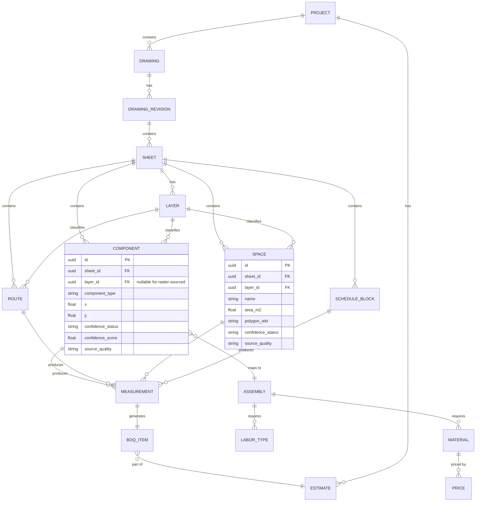

# AEC Blueprint Intelligence System — Design Specification (v3)

**Status:** Approved direction, ready for implementation
**Owner:** Saad Ahmad
**Supersedes:** v2 (`AEC-Blueprint-System-Design-Spec-v2.md`, removed 2026-08-22), which merged the original spec (`AEC-System-Design-Spec.md`) and the Phase 3 addendum — both also removed; recover via git history if needed.
**Purpose:** hand this to a coding agent as the sole source of truth. If a future task conflicts with this document, this document wins unless explicitly updated.

## Changelog from v2

- **Input Quality Gate added (§7.2, new).** v2 implicitly treated layer-rich vector PDFs (like the sample) as the expected case. Real-world CAD-to-PDF practice says otherwise: building-permit portals commonly require flattening before submission, generic print-to-PDF drivers strip layers by default, and some firms flatten deliberately to prevent exactly the kind of automated takeoff this system does. The sample file is now explicitly framed as the **best case**, not the median case (§5.5), and the pipeline has an explicit step to detect and react to degraded input instead of silently running a worse pipeline.
- **Raster/CV fallback engine rewritten (§7.7).** Ultralytics YOLOv8 required an Enterprise License even for purely internal, non-distributed company use under AGPL-3.0 — a real, unbudgeted legal/cost exposure that was sitting undisclosed in v2's tech stack table. Removed as the default. Replaced with a two-technique split: classical CV template/feature matching (OpenCV, no license, no training) for legend-based symbol counting, and Detectron2 (Apache-2.0) reserved for the one sub-problem — architectural region segmentation — that actually benefits from a trained model.
- **Clustering algorithm changed (§7.4).** DBSCAN's density parameters needed per-drawing tuning and produced boundaries that are hard to explain to a human reviewer. Replaced with deterministic distance-threshold clustering (union-find), with the threshold derived from the sheet's own calibrated legend-symbol size — no tuning knob, plain-language justification for every cluster.
- **Rotation-aware OCR added (§7.7).** Construction drawings routinely have text rotated to follow walls or dimension lines; this was previously unaddressed.
- **New Stage 1.5 — Raster Fallback Spike (§12a).** Given the flattening risk, the raster path can no longer be an indefinite someday-fallback. A lightweight version moves earlier, run in parallel with Stage 1 rather than waiting for Stage 2.
- **Review-time-per-sheet added as a tracked metric (§7.13, §15)**, with a target threshold folded into Stage 1's definition of done — the commercial case for this system depends on review overhead staying low, so it's measured from day one instead of assumed.
- Resolved from v2's open questions: the YOLOv8 licensing question is now decided (§9). Still open: the `pytest`/`ruff` convention (unverified in any doc reviewed) and the vector-count reconciliation (§5.2, unchanged from v2).
- Everything else — guiding principle, architecture decision, MVP scope, data model — carries forward unchanged.

---

## 1. Problem statement

Build a system that ingests construction blueprints (BIM/CAD files, vector PDFs, or scanned/raster images) and produces:

1. **Geometric quantities** — lengths, areas, volumes, counts of walls, roads, gates, stairs, rooms, and electrical/mechanical components
2. **Raw material estimates** — cement, concrete, rebar, bricks, marble, sand, water, etc., derived from geometry via engineering formulas
3. **Priced estimates** — quantities × a user-supplied price catalog
4. **Scope of work and workforce requirements** — trades needed, headcount, labor-hours/days

Delivery: Python backend behind a web interface. Upload a blueprint (PDF or image); backend processes it; system returns structured, priced, traceable results.

**The core technical risk is accuracy** — not detection speed.

---

## 2. Guiding principle (do not violate this)

> **AI proposes. Geometry calculates. Engineering rules derive. Humans approve.**

- ✅ AI/LLM may *propose* a classification or interpretation.
- ✅ Geometry engine *measures* from real coordinates.
- ✅ Rules/assembly engine *derives* materials and labor deterministically.
- ❌ **No LLM or vision model ever outputs a final quantity, length, or price directly.**

Every component below, including the risk-mitigation additions, is built to keep this true — the Input Quality Gate (§7.2) *flags* degraded input, it doesn't guess through it; the classical-CV symbol matcher (§7.7) still routes anything below a match-confidence threshold to human review, never to an assumed count.

---

## 3. Field classification

| Layer | Field | Used for |
|---|---|---|
| Ingestion | Document parsing, computational geometry | Vector PDF / CAD parsing |
| Ingestion (fallback) | Computer vision, OCR | Scanned/raster/flattened drawings |
| Interpretation | Multimodal AI / LLMs | Legend/schedule interpretation, ambiguous classification, scope-of-work narration |
| Calculation | Knowledge engineering, rule-based systems | Quantity → material/labor derivation |
| Domain knowledge | Quantity surveying / QTO standards | Assembly formulas, productivity rates, waste factors |
| Product | Web/backend engineering | Everything holding it together |

---

## 4. Architecture decision: hybrid, vector-first, rules-driven, human-verified

**Decision:** Three-tier ingestion (BIM/CAD → vector PDF → raster image) feeding a canonical drawing model, a deterministic assembly/rules engine, and mandatory human review before any number is finalized.

**Rejected alternatives:** pure CV/ML-only (accuracy ceiling too low for a bid), BIM-digital-twin-first (right destination, wrong starting point), LLM-vision-only (no traceability, will hallucinate quantities).

**Revised framing (v3):** vector-first is the *preferred* path when available, not the *assumed default input*. See §5.5 and §7.2 — this distinction is the core of this revision.

---

## 5. Reference analysis — ground truth from a real sample drawing

The sheet `MMC-JVC-CD-ELEC-3902_AC-WIRE` (Jeddah VIP Clinic, basement 2, scale 1:100, AutoCAD-exported PDF) has been analyzed twice with different toolchains.

### 5.1 Structure
- 1 page, 842×1191pt. Only 2 embedded raster images, both title-block logos — the drawing itself is 100% vector.
- 46 named CAD layers (OCGs) spanning five disciplines: architectural, electrical (multiple subsystems), envelope, material-rendering metadata (non-structural — hatch/pattern/call-out layers, not engineering specs), and annotation.
- Every vector path carries a `layer` attribute; text is layer-tagged independently via `BDC /OC … EMC` content-stream nesting.

### 5.2 Vector volume — three numbers, three units, not yet reconciled
| Figure | Method | What it counts |
|---|---|---|
| 88,523 | `PyMuPDF get_drawings()` | Path/drawing objects |
| 116,059 lines / 611 curves / 284 quads | PyMuPDF, segment items within those objects | Individual segment items |
| 76,991 lines / 12,175 curves / 171 rects (89,337) | Raw content-stream walk (`pikepdf`/`pdfminer.six`) | Raw paint operations |

Unresolved — do not use any of these as a regression-test ground truth until one canonical method is picked and the others reconciled against it (§16).

### 5.3 Per-layer breakdown
| Layer | Paint ops | % of sheet | Domain |
|---|---|---|---|
| `M_SAUDI_AREAS` | 59,112 | 66.8% | Architectural — room/space polygons |
| `M_SAUDI_NPLT` | 11,675 | 13.2% | Material rendering (non-structural) |
| `M_SAUDI_DOT` | 4,828 | 5.5% | Grid/dimension markers |
| `E-PWER-CABL-TRAY-HATCH` | 3,453 | 3.9% | Electrical — power cable tray |
| `M_SAUDI_WATER_INSULATING` | 2,839 | 3.2% | Envelope — waterproofing |
| `access control` | 296 | 0.3% | Electrical — access control (Stage 0 scope) |
| *(40 more layers)* | ~3,400 | ~3.9% | Mixed |

### 5.4 Text–layer association
Room name/area text sits on its own layers (`M_SAUDI_ROOM-nametr`, `M_SAUDI_ROOM-area`), siblings of the room-polygon layer — associating them is a spatial join, not a stream-nesting relationship. Schedule text (elevator specs, ramp slopes, parking IDs) is largely untagged and needs spatial clustering + pattern-matching instead of layer-filtering.

### 5.5 External validity of this sample — new in v3, read before trusting §5.1–5.4 as typical

**This sheet is the best case, not the median case, for what the pipeline will actually receive.** CAD-to-PDF layer preservation is not the default outcome of "export to PDF" in real practice:

- Multiple city building-permit portals explicitly require submissions to be flattened before they'll accept them, returning unflattened files to the applicant.
- Generic print-to-PDF drivers strip layer data by default; preserving it requires the specific CAD-native export path with layers explicitly enabled.
- There's also a non-technical reason drawings arrive flattened: some firms strip layer data deliberately, precisely to prevent the kind of automated symbol counting this system performs, when handing drawings to contractors or competitors.

**Implication:** treat every incoming file as layer-rich only after the Input Quality Gate (§7.2) confirms it, never by default. This is also the strongest practical argument for closed/single-company deployment over public SaaS (§13's earlier recommendation, now reinforced): only for your own company's exports do you have any lever to fix this at the source rather than compensate for it downstream.

---

## 6. High-level architecture

```
                    INPUT
       ┌──────────────┼───────────────┐
       │               │               │
   CAD / BIM      Vector PDF      Raster image
   (IFC/DWG/DXF)  (AutoCAD export) (scan/photo/flattened)
       │               │               │
       └───────────────┼───────────────┘
                        ▼
                Ingestion Router
                        ▼
        Input Quality Gate (NEW)
   (scores layer-richness; flags degraded files;
    requests re-export when the deployment allows it)
          ┌─────────────┴─────────────┐
          ▼ (layer-rich)               ▼ (degraded / raster)
 Layer Registry & Domain           Raster / CV Fallback Engine
 Classifier                        ├─ Classical CV template match
          ▼                        │  (legend-based symbol counting)
 Vector Parsing Engine             ├─ Detectron2 region segmentation
 (distance-threshold clustering,   │  (walls/rooms — trained model)
  polygon reconstruction,          └─ Rotation-aware OCR
  route tracing)                            │
          ▼                                 │
 Text–Layer Association Walker              │
          ▼                                 │
 Legend & Schedule/Attribute-Block Parser    │
          └───────────────┬─────────────────┘
                        ▼
               Canonical Drawing Model
    (Component / Route / Space / ScheduleBlock,
     each MEASURED / DERIVED / ASSUMED / UNMAPPED)
                        ▼
        ┌───────────────┴────────────────┐
        ▼                                 ▼
 Assembly & Rules Engine            Cost & Labor Catalog
        └───────────────┬────────────────┘
                        ▼
              Quantity & Cost Engine
                        ▼
     Human Review UI (filterable; review-time tracked)
                        ▼
             BOQ / Cost Estimate / Scope of Work
```

---

## 7. Component specifications

### 7.1 Ingestion router
Inspect the file on upload: PDF → compare vector-path density vs. embedded raster image coverage. DWG/DXF → CAD path (`ezdxf`), always preferred when available. PNG/JPG/scanned PDF → raster path.

### 7.2 Input Quality Gate *(new)*
Sits between the router and everything else. Its job: don't let a degraded file silently run the wrong pipeline.
- For a "vector path" file, don't stop at the binary vector/raster decision — score **layer richness**: count of distinct OCGs, fraction of paths carrying a non-null `layer` attribute, presence of extractable legend/schedule text.
- If layer richness is below a threshold (e.g. fewer than 3 distinct layers, or >90% of paths on layer `0`/none — consistent with a flattened export), flag the file `degraded_vector` rather than treating it as the happy path.
- **In closed/internal deployment:** loop back — surface a message to the uploader ("this file has no layer data; re-export with layers included, or provide the native DWG/DXF") before falling through to the raster pipeline. This is only possible because the deployment target is your own company or a controlled partner — see §5.5.
- If loop-back isn't possible (external bid document, no control over the source), route to §7.7 automatically, and tag every downstream measurement from that file with a lower base confidence multiplier — the review UI (§7.13) should visibly distinguish "measured from a flattened file" from "measured from a layered file."

### 7.3 Layer Registry & Domain Classifier
Enumerate every OCG on the sheet, classify by regex against a human-editable config:
```yaml
layer_classification_rules:
  - pattern: '^(M_SAUDI_(WALL|DOOR|STAIRS|ROOM|AREAS)|M-PART-GLZW)'
    discipline: architectural
  - pattern: '^(E-|ADO |FIRE ALARM|NORMAL TRAY|access control)'
    discipline: electrical
  - pattern: '^M_SAUDI_(WATER_INSULATING|VENT_identy|RAIN)'
    discipline: envelope
  - pattern: '^M_SAUDI_(MAT|METAL|PATT|NPLT|PRPT|AGRAF|DOT|ACCESSORY|HIDDEN)'
    discipline: material_rendering   # non-structural
  - pattern: '.*'
    discipline: unclassified
```
Persisted per sheet in `LAYER` (§8), human-correctable.

### 7.4 Vector parsing engine — deterministic clustering (revised in v3)
Branches by classified geometry type: symbol-instance clustering, polygon/region reconstruction, or route/polyline tracing.

**Clustering method, changed from DBSCAN to distance-threshold connected-components:**
```python
# Deterministic — no density parameter to tune, no probabilistic boundary.
# threshold_mm comes from the sheet's own smallest legend symbol's
# real-world bounding-box diagonal (measured once per sheet via the
# calibrated scale factor from the title block).

def cluster_paths(paths, threshold_mm, scale_factor):
    threshold_px = threshold_mm / scale_factor
    index = build_spatial_index(paths)          # e.g. an R-tree
    uf = UnionFind(len(paths))
    for i, j in index.candidate_pairs(threshold_px):
        if bbox_distance(paths[i], paths[j]) <= threshold_px:
            uf.union(i, j)
    return uf.groups()
```
Why this over DBSCAN: the merge rule reduces to a sentence a human reviewer can be given verbatim — "these line segments are within N real-world millimeters of each other, the size of the smallest symbol on this sheet's own legend" — instead of a density parameter tuned per drawing. Matches §2's determinism/auditability requirement more directly than a density-based method.

For polygon reconstruction (`M_SAUDI_AREAS`-style layers):
```python
from shapely.ops import polygonize
from shapely.geometry import LineString
rooms = list(polygonize([LineString([p['p1'], p['p2']]) for p in layer_paths]))
```
Filter by area threshold, cross-check against paired name/area text (§7.5) before accepting as a `Space`. `networkx`-based planar-graph fallback only if `polygonize` proves insufficient on a real sheet — don't pre-build it.

Scale is read from the title block or a dimension/scale-bar cross-check per sheet — never assumed globally.

### 7.5 Text–Layer Association Walker
Verify whether the installed PyMuPDF version exposes OCG membership on text spans directly; if not, a `BDC/EMC`-tracking content-stream walker (validated against the sample) is the fallback. Spatially joins name/area text to the nearest polygon centroid, producing a labeled, area-verified `Space` — geometry measures, text confirms, no model involved.

### 7.6 Legend & Schedule/Attribute-Block Parser
Detects any tabular symbol-key block (not assuming exactly one legend per sheet) and matches cluster counts against whichever table is present. For untagged schedule text (elevator specs, ramp slopes, parking IDs): spatial clustering of nearby text runs, then a config-driven regex library for known AEC field shapes; anything unmatched goes to the LLM interpretation tier as a *proposal*, confirmed by a human.

### 7.7 Raster / CV fallback engine — rewritten in v3
Split into two techniques matched to two different sub-problems, plus rotation-aware OCR. This split removes the licensing exposure that came from defaulting to a single heavy detector for everything.

**A. Legend-based symbol counting → classical computer vision, not a trained detector.**
Since the design already commits to matching detected symbols against *the document's own legend* rather than a universal symbol vocabulary, a trained deep detector is more than the sub-problem needs. Use OpenCV `matchTemplate` or ORB/SIFT keypoint matching against glyph templates extracted directly from the sheet's own legend table:
```python
import cv2
template = extract_glyph_from_legend(legend_region, symbol_name)
result = cv2.matchTemplate(page_image, template, cv2.TM_CCOEFF_NORMED)
matches = non_max_suppression(result, threshold=0.8)
```
No training data, no model license, and it mirrors the vector-path legend-matching strategy (§7.6) closely enough that the two are conceptually the same technique on two different input types.

**B. Architectural region segmentation → Detectron2 (Apache-2.0).**
For walls/rooms/doors with no legend entry to match against — the one sub-problem that genuinely benefits from a pretrained model (e.g. CubiCasa5K-style pretraining). This is the sole trained-model dependency in the stack; it carries no AGPL obligation.

**On Ultralytics YOLOv8, explicitly:** not used by default. AGPL-3.0 requires an Enterprise License for internal proprietary use, not only for public distribution — confirmed directly by the vendor. Revisit only if A+B prove insufficient on real degraded files, and only as a deliberate, budgeted licensing decision — not a default `pip install`.

**C. Rotation-aware OCR (new).** Construction drawings routinely have text rotated to follow walls or dimension lines. Where hybrid vector context exists (a flattened file that still has *some* vector line data nearby), use the angle of the nearest line segment as a rotation prior before OCR. For a pure scan with no vector data at all, run a brute-force angle sweep (0°/90°/180°/270°, refined in finer steps if needed) and keep the OCR result with the highest confidence score.

All raster-derived measurements carry a lower base confidence than vector-derived ones (§7.12), and are visibly tagged as raster-sourced in the review UI.

### 7.8 Canonical drawing model
`Component`, `Route`, `Space`, `ScheduleBlock`, `Annotation` — each stores `source_sheet`, `source_region`, `layer_id` (FK into `LAYER`, or null for raster-sourced items with no layer), `measurement_type`, `raw_value`, `confidence_status`, `confidence_score`, and a `source_quality` flag (`layered_vector` / `degraded_vector` / `raster`) from the Input Quality Gate.

### 7.9 Assembly & rules engine
Configurable, human-editable, versioned — never a trained model:
```yaml
assembly: access_control_door
requires: {card_reader: 1, magnetic_lock: 1, push_button: 1, door_controller: 0.5}
labor: {installation_hours: 2.5, testing_hours: 0.5}
```
A measured element with no matching rule yet is tagged `UNMAPPED`, not dropped or forced.

### 7.10 Cost & labor catalog
Materials/labor rates in a DB or YAML catalog, scoped per company/region/supplier — never hardcoded in application code.

### 7.11 Quantity & cost engine
Pure, unit-tested arithmetic. Zero AI involvement.

### 7.12 Confidence tiering
`MEASURED` / `DERIVED` / `ASSUMED` / `UNMAPPED`, each also carrying the `source_quality` flag from §7.2/§7.8 so a reviewer can distinguish "measured, high-confidence, layered vector" from "measured, lower-confidence, raster-derived from a flattened file." Never blend into one accuracy percentage.

### 7.13 Human review UI — instrumented in v3
Overlay every extraction on the original drawing; click-through to source; bulk-accept high-confidence `MEASURED` items; filter/group by discipline, layer-classification confidence, and now also by `source_quality`.
**New:** instrument and log average review time per sheet and per confidence tier, from Stage 0 onward. This isn't cosmetic — it's the direct measure of whether the system is actually saving time over manual takeoff, which is the entire commercial case for building it. See §15.

### 7.14 Output generation
BOQ, BOM, LLM-narrated scope of work (from structured data, never raw images), workforce/labor estimate. Export: JSON, XLSX, PDF.

---

## 8. Data model

*(Unchanged from v2 — `LAYER`, `SCHEDULE_BLOCK`, and layer-FK'd `COMPONENT`/`ROUTE`/`SPACE` already accommodate the v3 additions. Add `source_quality` as a column on `COMPONENT`, `ROUTE`, `SPACE`, and `SCHEDULE_BLOCK`: `string source_quality  -- layered_vector | degraded_vector | raster`.)*


*(Remaining entity blocks — `PROJECT`, `DRAWING`, `LAYER`, `SCHEDULE_BLOCK`, `ROUTE`, `ASSEMBLY`, `MATERIAL`, `PRICE`, `MEASUREMENT`, `BOQ_ITEM`, `ESTIMATE` — unchanged from v2.)*

---

## 9. Tech stack — revised in v3

| Layer | Choice | Notes |
|---|---|---|
| Backend framework | FastAPI | unchanged |
| Vector PDF parsing | PyMuPDF (`pymupdf`) | import as `pymupdf`, never `fitz` |
| PDF cross-validation | `pikepdf`, `pdfminer.six` | dev-time only |
| CAD parsing | `ezdxf` | when DWG/DXF available |
| BIM parsing | `ifcopenshell` | Stage 3, LGPL — no closed-source obligation |
| **Symbol detection (raster)** | **OpenCV (`matchTemplate`, ORB/SIFT)** | **default — legend-based template matching, no training, no license cost** |
| **Region segmentation (raster)** | **Detectron2 (Apache-2.0)** | **default — sole trained-model dependency; CubiCasa5K-style pretraining for walls/rooms** |
| ~~Object detection~~ | ~~Ultralytics YOLOv8~~ | **removed as default — AGPL-3.0 requires an Enterprise License even for internal-only use; revisit only as a deliberate paid decision if A/B above prove insufficient** |
| OCR | PaddleOCR (primary) / Tesseract (fallback) | + rotation-aware preprocessing (§7.7C) |
| Geometry ops | Shapely (`polygonize`); `networkx` conditional fallback | |
| Database | PostgreSQL (+ PostGIS if needed) | |
| Job queue | Redis + Celery | |
| Object storage | S3-compatible | |
| Frontend | Next.js + TypeScript | |
| Review UI overlay | Canvas/SVG over `pdf.js`, with review-time instrumentation | |
| Auth | Clerk | |
| LLM interpretation | Claude API | proposals only, never final quantities |
| Containerization | Docker (+ Kubernetes later) | |

---

## 10. API surface

Unchanged from v2, plus:
```
GET    /drawings/{id}/quality              # Input Quality Gate score + flags
POST   /drawings/{id}/request-reexport     # loop-back request to uploader (closed deployment)
GET    /projects/{id}/review-metrics       # average review time per sheet / per tier
```

---

## 11. Stage 0 — MVP: Access Control Takeoff

Unchanged from v2. Vector-only, single-layer, sample sheet as fixture, every number traceable to a highlighted source region. This remains the first thing built and proven.

---

## 12. Stage 1 — Extraction Breadth

Unchanged in substance from v2 (Layer Registry spike → Space extraction → generalized clustering → text-layer walker → schedule parser → data model migration → `UNMAPPED` status → review UI filtering → definition of done: every one of the 46 layers classified/extracted or explicitly flagged unclassified).

**New Stage 1 addition:** run the Input Quality Gate spike alongside the Layer Registry spike — deliberately produce a flattened version of the same sample sheet (e.g. print-to-PDF or a "discard hidden layers" export) and confirm the gate correctly flags it `degraded_vector` and triggers the loop-back message. This validates §7.2 against ground truth you already control, the same way the Layer Registry spike validates §7.3 against the sample's 46 layers.

## 12a. Stage 1.5 — Raster Fallback Spike *(new, moved earlier)*

**Trigger:** §5.5's finding that flattened/raster input is not a rare edge case. Waiting until Stage 2 to touch the raster path risks discovering it's a dead end only after the vector-side work is otherwise complete.

Lightweight, not production-grade:
1. Take the legend region from the sample sheet's rendered image; extract glyph templates for each legend entry.
2. Run classical template matching (§7.7A) against a rendered (non-vector) version of the same sheet.
3. Compare counts against the Stage 0 vector-derived ground truth — this is a real accuracy benchmark for the raster path, on a file where you already know the right answer.
4. Do not build Detectron2 region segmentation (§7.7B) yet — that's real Stage 2 scope. This spike is scoped to proving the symbol-counting half of the raster path isn't a dead end.

---

## 13. Stage 2+ — Domain Depth Rollout, and Stage 3 — BIM/Digital Twin

Unchanged from v2. Extraction is discipline-agnostic after Stage 1; "which domain is next" means which domain gets assembly/costing rules, not which domain gets looked at.

1. Stage 2a — Electrical (full discipline)
2. Stage 2b — Mechanical
3. Stage 2c — Plumbing & fire protection
4. Stage 2d — Architectural (this is where Detectron2 region segmentation, §7.7B, earns its place for real)
5. Stage 2e — Structural (needs structural drawing sets + reinforcement schedules, not just this sheet's layers)
6. Stage 2f — Whole-building estimator
7. Stage 3 — BIM/digital-twin (long-term)

---

## 14. Explicit non-goals / what not to promise

- Do **not** promise "upload any blueprint, get a 100% accurate BOQ automatically."
- Do **not** let an LLM/vision model be the final source of a quantity, length, or price.
- Do **not** attempt raw-material estimation from a single-discipline drawing, and do **not** treat this sheet's material-rendering layers as sufficient for one (§5.1).
- Do **not** assume incoming files are layer-rich vector PDFs by default — always run the Input Quality Gate first (§7.2, §5.5).
- Do **not** default to a detector requiring an unbudgeted commercial license (§7.7, §9) — classical CV + Detectron2 cover the raster path without one.
- Do **not** build a universal cross-company symbol detector before the legend-based matching approach is exhausted, on either the vector or raster path.

---

## 15. Accuracy & validation strategy

- Track accuracy per confidence tier, and now also per `source_quality` tier — a `MEASURED` count from a flattened raster file is not the same claim as a `MEASURED` count from a layered vector file; report them separately.
- Log human-review corrections; periodically refine assembly rules and, later, the classical-CV template library and Detectron2 weights.
- Cross-tool validation (pikepdf/pdfminer.six vs. PyMuPDF) is good practice — confirm both are measuring the same unit before treating agreement as a signal (§5.2).
- **New: track average human review time per sheet and per confidence tier from Stage 0 onward.** Set a target threshold with the business stakeholder before Stage 1 is called complete. If review time doesn't stay under it as layer coverage grows, treat that as a blocking product issue — recalibrate confidence thresholds or bulk-accept rules before continuing the rollout, not after.
- Before any public accuracy claim, benchmark against 3–5 already-estimated real projects.

---

## 16. Open questions for the build team

- **Testing/tooling convention — still unverified.** The `python -m pytest` / `python -m ruff check` rule doesn't appear in any document reviewed here. Confirm and merge its source doc in.
- **Vector-count reconciliation — still open.** Pick one canonical counting method from §5.2 before it becomes a regression-test fixture.
- **Input Quality Gate thresholds** — the specific cutoffs for `degraded_vector` (layer count, fraction of untagged paths) need calibration against a handful of real files beyond just the one sample, both layered and deliberately flattened.
- **Ultralytics YOLOv8 — resolved for now.** Not used by default (§7.7, §9). Revisit only if the classical-CV + Detectron2 split proves insufficient on real degraded files, as a deliberate licensing decision at that point.
- Will most incoming drawings be layer-rich, or should the team plan around degraded input being the norm rather than the exception? This materially changes how much of Stage 1.5 gets invested versus deferred.
- Is there access to native DWG/DXF/IFC instead of PDF exports? Still the highest-leverage fix for §5.5's risk if available.
- Which company's price catalog and productivity rates seed the Cost & Labor Catalog first?
- Confirmed direction: single closed/internal tool first (§5.5 strengthens this further — it's the only deployment where the Input Quality Gate's loop-back request is actually actionable).
