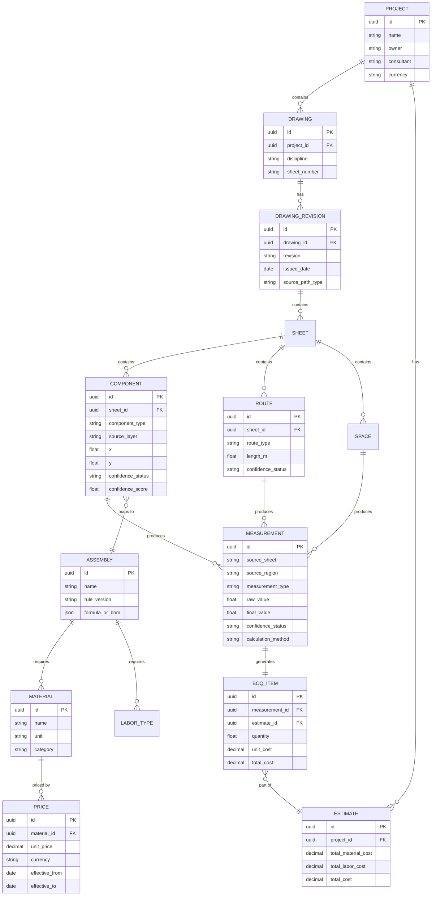

# AEC Blueprint Intelligence System — Design Specification

**Status:** Approved direction, ready for implementation
**Owner:** Saad Ahmad
**Purpose of this document:** hand this to a coding agent (Claude Code or similar) as the source of truth for building the system. It covers the problem, the architecture decision, every pipeline component, the data model, the tech stack, the MVP scope, and the phased roadmap. If anything in a future task conflicts with this document, this document wins unless explicitly updated.

---

## 1. Problem statement

Build a system that ingests construction blueprints (BIM/CAD files, vector PDFs, or scanned/raster images) and produces:

1. **Geometric quantities** — lengths, areas, volumes, counts of walls, roads, gates, stairs, rooms, and electrical/mechanical components (circuit boards, switches, buttons, card readers, locks, cable runs, conduit, trunking, etc.)
2. **Raw material estimates** — cement, concrete, rebar, bricks, marble, sand, water, etc., derived from the geometry via engineering formulas
3. **Priced estimates** — quantities × a user-supplied price catalog
4. **Scope of work and workforce requirements** — which trades are needed, how many people, how many labor-hours/days

Delivery: a Python backend behind a web interface. User uploads a blueprint (PDF or image); backend processes it; system returns structured, priced, traceable results.

**The core technical risk is accuracy** — not detection speed. This document's architecture is built around de-risking accuracy, not around building the fanciest model.

---

## 2. Guiding principle (do not violate this)

> **AI proposes. Geometry calculates. Engineering rules derive. Humans approve.**

Concretely:

- ✅ A vision model or LLM may *propose* "this symbol is probably a card reader" or *interpret* an ambiguous legend entry.
- ✅ A geometry engine *measures* distances, areas, and counts from real coordinates.
- ✅ A rules/assembly engine *derives* materials and labor from measured quantities using deterministic formulas.
- ❌ **No LLM or vision model ever outputs a final quantity, length, or price directly.** If a number appears in a BOQ, it must be traceable to a deterministic calculation, not a model's guess.

This single rule is the difference between a system professionals can trust and a demo that quietly produces wrong bids. Every component spec below exists to enforce it.

---

## 3. Field classification (context, not action items)

This problem spans multiple CS/engineering disciplines — plan the team/skills accordingly:

| Layer | Field | Used for |
|---|---|---|
| Ingestion | Document parsing, computational geometry | Vector PDF / CAD parsing |
| Ingestion (fallback) | Computer vision, OCR | Scanned/raster drawings |
| Interpretation | Multimodal AI / LLMs | Legend interpretation, ambiguous symbol classification, natural-language scope-of-work generation |
| Calculation | Knowledge engineering, rule-based systems | Quantity → material/labor derivation |
| Domain knowledge | Quantity surveying / QTO standards | Assembly formulas, productivity rates, waste factors |
| Product | Web/backend engineering | Everything holding it together |

Industry term for the product category: **AI-assisted AEC / construction quantity-takeoff (QTO) software.** This is a validated, active market (Togal.AI, Beam AI, Kreo, STACK, ProEst, Autodesk Takeoff, Procore, PlanSwift) — the system is not solving an unsolved problem, it's building a well-understood pipeline, scoped to your own use case.

---

## 4. Architecture decision: hybrid, vector-first, rules-driven, human-verified

**Decision:** Build a three-tier ingestion pipeline (BIM/CAD → vector PDF → raster image, in order of preference) feeding a single canonical drawing model, followed by a deterministic assembly/rules engine, followed by mandatory human review before any number is finalized.

**Rejected alternatives and why:**

- ❌ *Pure CV/ML pipeline (image in, quantities out)* — fastest MVP, but accuracy caps out well below what a bid or budget can rely on, especially on dense multi-discipline sheets. Use it only as a fallback for non-vector inputs.
- ❌ *BIM/digital-twin-first (full IFC ontology from day one)* — the strongest long-term architecture, but too much scope before anything is proven. This is the eventual destination, not the starting point.
- ❌ *LLM-vision-only ("show GPT-4V the PDF, ask for the BOQ")* — no traceability, no auditability, and it will confidently hallucinate quantities. Never use an LLM as the source of truth for a measurement.

**Why vector-first is viable, not aspirational** — see Section 5. This isn't a hopeful assumption; it was verified against a real project drawing.

---

## 5. Reference analysis — ground truth from a real sample drawing

A real project sheet (`MMC-JVC-CD-ELEC-3902_AC-WIRE`, an access-control electrical drawing, Jeddah VIP Clinic Project, basement 2, scale 1:100, AutoCAD-exported PDF) was analyzed with PyMuPDF. Findings, which should anchor the ingestion engine's design and serve as its first automated test fixture:

- **1 page**, page size 1191×842 pt.
- **Only 2 embedded raster images** — both are logos in the title block (Saudi Sicli, Moataz Makki), not the drawing itself. The drawing content is 100% vector.
- **88,523 vector drawing objects**, dominated by ~116,000 straight line segments, plus ~611 quad curves and 284 curves.
- **46 named CAD layers preserved as PDF Optional Content Groups (OCGs)** — e.g. `M_SAUDI_WALL_PRHT`, `M_SAUDI_STAIRS`, `M_SAUDI_DOOR`, `access control`, `FIRE ALARM`, `NORMAL TRAY`, `E-PWER-CABL-TRAY-HATCH`, `ADO CCTV LEADER`, `E-lt-fix-nm-clg`, `A-ANNO-SYMB`.
- **Every single vector path object carries a `layer` attribute** identifying which of the 46 layers it belongs to (confirmed via `page.get_drawings()` → each dict has a `layer` key).
- The `access control` layer alone contains 296 raw line-segment paths, which cluster spatially into a handful of discrete symbol instances (readers, locks, buttons) — a spatial-clustering problem, not an object-detection problem.
- **315 text blocks / 384 text spans** are extractable as real text with coordinates — dimensions ("2100cm"), slopes ("%15.2"), cable specs ("14 AWG (2×2.5)mm SHIELDED TWISTED PAIR"), room areas, the full legend table, and the title block.

**Implication:** for AutoCAD-exported PDFs (the likely norm for the drawings this system will process), symbol classification can be done largely by **CAD-layer filtering + spatial clustering**, not deep learning. Reserve the CV/ML fallback for drawings that arrive as scans, photos, or flattened/rasterized PDFs.

---

## 6. High-level architecture

```
                    INPUT
       ┌──────────────┼───────────────┐
       │               │               │
   CAD / BIM      Vector PDF      Raster image
   (IFC/DWG/DXF)  (AutoCAD export) (scan/photo)
       │               │               │
       └───────────────┼───────────────┘
                        ▼
              Ingestion & Parsing Engine
        (vector-first extraction; CV+OCR fallback)
                        ▼
               Canonical Drawing Model
     (geometry + CAD layers + text, each item tagged
        MEASURED / DERIVED / ASSUMED confidence)
                        ▼
        ┌───────────────┴────────────────┐
        ▼                                 ▼
 Assembly & Rules Engine            Cost & Labor Catalog
 (component → material/labor)      (unit prices, productivity)
        └───────────────┬────────────────┘
                        ▼
              Quantity & Cost Engine
              (deterministic calculations only)
                        ▼
                Human Review UI
        (every number click-through to source geometry)
                        ▼
             BOQ / Cost Estimate / Scope of Work
```

---

## 7. Component specifications

### 7.1 Ingestion router
On upload, inspect the file:
- PDF → open with PyMuPDF, count `page.get_drawings()` vs `page.get_images()`. If vector path count is high relative to page count and text is extractable → **vector path**. If the page is dominated by 1–2 full-page raster images → **raster path**.
- DWG/DXF → **CAD path** (`ezdxf`), always preferred when available — ask users/companies to supply native CAD files when possible, since it skips PDF-export quirks entirely.
- PNG/JPG/scanned PDF → **raster path**.

Route logged per file; downstream components branch on this decision.

### 7.2 Vector parsing engine (primary path)
- Library: `PyMuPDF` (`pymupdf`, import as `pymupdf`, not the deprecated `fitz` alias).
- Extract: `page.get_drawings()` (paths + `layer` attribute), `page.get_text('dict')` (text spans with bbox + font size), `doc.get_ocgs()` (layer name registry).
- Cluster same-layer paths by spatial proximity (e.g. DBSCAN on path bounding-box centroids, tuned per layer) into discrete component instances.
- Classify each cluster: first by CAD layer name (deterministic, e.g. `access control` layer + shape signature → likely reader/lock/button), falling back to a legend-matching step (7.9) when the layer name alone is ambiguous.
- Determine scale from the title block text (e.g. "1/100") plus known sheet paper size, or from an explicit scale bar/dimension string cross-check. Store scale factor per sheet — never assume a global default.
- Output: a list of typed geometry objects (walls, routes, symbol instances, rooms, dimension strings) with real-world coordinates, each linked back to its raw source paths for traceability.

### 7.3 Raster / CV fallback engine (secondary path)
- Render page to image at high DPI (PyMuPDF `page.get_pixmap(dpi=...)`).
- OCR: PaddleOCR or Tesseract for text/dimensions/legend.
- Object detection: Ultralytics YOLOv8 (or Detectron2) — **do not train a universal "construction symbol" detector.** Instead:
  1. OCR + parse the sheet's own legend table (symbol glyph → text description), same as a human estimator would read it.
  2. Template/few-shot match detected shape clusters against that document's own legend entries.
  3. Fall back to a general wall/door/window segmentation model (pretrained on CubiCasa5K or similar) only for architectural elements without a custom legend.
- Scale calibration: same principle as 7.2 — from a stated scale + known sheet size, or a detected scale bar, never assumed.
- Every raster-derived measurement is tagged with lower base confidence than a vector-derived one (see 7.8).

### 7.4 Canonical drawing model
Unified internal representation regardless of source path. Every element becomes one of:
- `Component` (door, card reader, lock, fixture, panel, etc.) — position, type, source layer/legend match, confidence.
- `Route` (cable run, pipe run, conduit) — ordered polyline, measured length, waste factor applied.
- `Space` (room, parking bay) — polygon, area, name/label.
- `Structural element` (wall, stair, ramp) — polyline/polygon, dimensions.
- `Annotation` (dimension string, note, schedule entry) — raw text + position.

Every object stores: `source_sheet`, `source_region` (bbox or path IDs), `measurement_type`, `raw_value`, `confidence_status` (`MEASURED` / `DERIVED` / `ASSUMED`), `confidence_score`.

### 7.5 Assembly & rules engine
A configurable, human-editable rules layer — **not a trained model.** Two kinds of rules:

1. **Direct assemblies** (component → sub-components), e.g.:
   ```yaml
   assembly: access_control_door
   requires:
     card_reader: 1
     magnetic_lock: 1
     push_button: 1
     door_controller: 0.5   # 1 controller serves 2 doors
   labor:
     installation_hours: 2.5
     testing_hours: 0.5
   ```
2. **Formula-based derivations** (geometry → material), e.g.:
   ```yaml
   assembly: concrete_slab
   inputs: [area_m2, thickness_m]
   formula: "volume_m3 = area_m2 * thickness_m * (1 + waste_pct)"
   default_waste_pct: 0.05
   ```

Rules are versioned, editable per company/project, and every derived quantity records which rule version produced it.

### 7.6 Cost & labor catalog
A database of unit prices and productivity rates, scoped per company/region/supplier:
```
Material: id, name, category, unit, brand, spec, supplier, currency, unit_price, effective_from, effective_to
Labor rate: trade, unit, productivity (unit/hour), crew composition, hourly rate
```
User-supplied price lists are ingested here — never hardcoded. Multiple price sets can coexist (e.g. per supplier or per project) and be swapped without touching the geometry/quantity layers.

### 7.7 Quantity & cost engine
Pure arithmetic, fully unit-tested, zero AI involvement:
```python
material_cost = quantity * unit_price
labor_hours = measured_quantity / productivity_rate
labor_cost = labor_hours * hourly_rate
total = material_cost + labor_cost + equipment_cost + waste + contingency
```

### 7.8 Confidence tiering
Every output line carries a status, not just a number:

| Status | Meaning | Example |
|---|---|---|
| `MEASURED` | Directly read from vector geometry | Wall length from a CAD-layer polyline |
| `DERIVED` | Calculated via an assembly/formula from a measured input | Concrete volume from measured slab area × schedule thickness |
| `ASSUMED` | Filled from a historical/default assumption, no source data | Waterproofing area, no waterproofing drawing supplied |

Confidence score is a function of source path (vector > OCR > detection), rule certainty, and — for raster paths — model detection confidence. Never present a single blended "accuracy %" to the user; show the status per line.

### 7.9 Human review UI
Non-negotiable for v1, not a later polish pass:
- Overlay every extracted quantity/component on the original drawing.
- Click a BOQ line → highlight the exact source geometry/region on the sheet.
- Accept / correct / reject per item; corrections are persisted and logged as training/rule-improvement signal.
- Bulk-accept for high-confidence (`MEASURED`) items; force review for `ASSUMED` items.

### 7.10 Output generation
- BOQ (bill of quantities) — grouped by discipline/assembly, each line with quantity, unit, confidence status, source reference.
- BOM (bill of materials) — flattened material list with unit prices and totals.
- Scope of work — plain-language summary generated by an LLM **from the already-computed structured data**, not from raw images (LLM narrates, never calculates).
- Workforce/labor estimate — trade, hours, crew size, estimated duration.
- Export formats: JSON (API), XLSX, PDF.

---

## 8. Data model



Key design point: `MEASUREMENT` is the audit-trail table — every `BOQ_ITEM` traces back through it to `source_sheet` + `source_region` + `calculation_method`. This is what makes the human review UI (7.9) possible.

---

## 9. Tech stack

| Layer | Choice | Notes |
|---|---|---|
| Backend framework | FastAPI | async, good for job-status polling endpoints |
| Vector PDF parsing | PyMuPDF (`pymupdf`) | primary ingestion tool — verified against real sample |
| CAD parsing | `ezdxf` | when DWG/DXF is available |
| BIM parsing | `ifcopenshell` | later phase, IFC support |
| Raster CV | OpenCV + Ultralytics YOLOv8 | fallback path only |
| Segmentation (fallback) | Detectron2 or a CubiCasa5K-pretrained model | architectural wall/room detection on raster inputs |
| OCR | PaddleOCR (primary) / Tesseract (lightweight fallback) | |
| Geometry ops | Shapely | clustering, polygon/area math |
| Database | SQLite file-based for Phase 0 (works serverless + server); PostgreSQL (+ PostGIS) later via DATABASE_URL swap | | |
| Job queue | Redis + Celery | drawing processing is not instant, must be async |
| Object storage | S3-compatible (e.g. Cloudflare R2 / AWS S3 / MinIO self-hosted) | uploaded files + rendered previews |
| Frontend | Next.js + TypeScript | matches your existing stack |
| Review UI overlay | Canvas/SVG overlay on rendered PDF page (`pdf.js` for rendering) | |
| Auth | Clerk | matches your existing stack |
| LLM interpretation layer | Claude API (function-calling / structured output) | legend interpretation, ambiguous classification, scope-of-work narration only — never quantity calculation |
| Containerization | Docker (+ Kubernetes later if scaling multiple companies) | |

---

## 10. API surface (v1 sketch)

```
POST   /projects
POST   /projects/{id}/drawings          # upload PDF/image/DWG
GET    /drawings/{id}/status            # processing status (queued/parsing/done/error)
GET    /drawings/{id}/model             # canonical drawing model (components/routes/spaces)
POST   /drawings/{id}/review            # submit human corrections
GET    /projects/{id}/estimate          # computed BOQ/cost/labor estimate
POST   /catalogs/materials              # upload/update price catalog
POST   /catalogs/labor-rates            # upload/update productivity rates
GET    /assemblies                      # list/edit assembly rules
POST   /assemblies                      # create/version an assembly rule
```

---

## 11. MVP scope — Phase 1: Access Control Takeoff

Build this first, end to end, using the real sample sheet as the test fixture.

**In scope:**
- Upload a single electrical/access-control PDF sheet.
- Vector parsing path only (raster fallback is Phase 1.5, not required for MVP).
- Extract and cluster the `access control` (and related) CAD layers into discrete component instances: card readers, push buttons, magnetic locks, controllers.
- Measure cable trunk / conduit route lengths from vector geometry, calibrated to the sheet's stated scale.
- Apply one hardcoded assembly rule set (e.g. `1 controller per 2 doors`, from the legend on the sheet itself).
- Accept one manually-entered price row per material/labor type (full catalog UI comes later).
- Output a BOQ table where every row is clickable and highlights its source region on the rendered PDF.

**Explicitly out of scope for MVP:** raster/scanned drawings, raw building materials (concrete/rebar/bricks — these need structural/architectural sheets, not this one), multi-sheet projects, revision comparison, multi-user collaboration.

**Definition of done:** given the sample sheet, the system correctly counts the access-control components on the drawing (verify manually against the legend and drawing once — this becomes the regression test), computes correct cable/conduit lengths within the drawing's stated scale, and every output number is traceable back to a highlighted region on the rendered page.

---

## 12. Roadmap after MVP

1. **Phase 2 — Electrical (full discipline):** lighting, power, switches, sockets, distribution boards, cable trays.
2. **Phase 3 — Mechanical:** HVAC, ducts, pipes, equipment.
3. **Phase 4 — Plumbing & fire protection.**
4. **Phase 5 — Architectural:** walls, doors, windows, flooring, ceilings, finishes — this is where a CubiCasa5K-style model earns its keep for raster inputs.
5. **Phase 6 — Structural:** concrete, rebar, formwork, footings, columns, beams, slabs — requires structural drawing sets + reinforcement schedules, not just visual measurement.
6. **Phase 7 — Whole-building estimator:** cross-references all disciplines, drawing-set-level ingestion (upload the whole project package at once), revision/change tracking.
7. **Phase 8 (long-term) — BIM/digital-twin model:** IFC-native project knowledge graph, the ChatGPT-response's "Solution 3." Only attempt once Phases 1–7 are proven and stable.

Only after individual disciplines are independently reliable should the system attempt a single "upload anything, get a full building estimate" claim.

---

## 13. Explicit non-goals / what not to promise

- Do **not** market or design toward "upload any blueprint, get a 100% accurate BOQ automatically." No competitor honestly claims this either.
- Do **not** let an LLM/vision model be the final source of a quantity, length, or price — ever (Section 2).
- Do **not** attempt raw-material (concrete/rebar/masonry) estimation from a single-discipline drawing — it needs the structural/architectural set.
- Do **not** build a universal cross-company "construction symbol" detector before the legend-based, per-document matching approach is exhausted — it's cheaper, more accurate, and matches how the industry's own drawings work (custom legend per project, as seen in the sample).

---

## 14. Accuracy & validation strategy

- Track accuracy per confidence tier separately, not as one blended number.
- Every processed sheet's corrections (from the human review UI) get logged and periodically reviewed to refine assembly rules and, later, raster-path model weights.
- Before claiming any accuracy number publicly or to a client, benchmark against a held-out set of already-estimated real projects (start with 3–5 known projects and compare system output to the human-produced estimate).

---

## 15. Open questions for the build team

- Will most incoming drawings be AutoCAD-exported vector PDFs (like the sample) or a mix including scans? This determines how much Phase 1.5 (raster fallback) investment is justified early.
- Is there access to native DWG/DXF files instead of PDF exports for the target company/companies? If yes, prioritize `ezdxf` ingestion over PDF vector parsing — it's strictly higher fidelity.
- Which company's price catalog and productivity rates will seed the Cost & Labor Catalog first?
- Target deployment: single closed/internal tool for one company first (recommended), or multi-tenant from day one? (Recommended: single-tenant first — see prior discussion on public SaaS vs. closed enterprise.)
